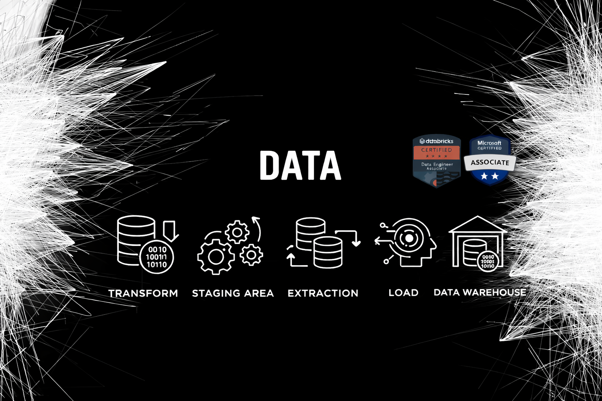

  

# Hi 👋, I'm Shubham

## 🚀 Azure Data Engineer

I am a passionate Data Engineer with 4+ years of experience building scalable
data pipelines using Azure Data Factory, Databricks, PySpark, Delta Lake,
and Medallion Architecture.

---

### 🔗 Connect with me
- 💼 LinkedIn: https://linkedin.com/in/your-profile
- 📺 YouTube: https://youtube.com/@yourchannel

---

### 🛠️ Languages & Tools

  
  
  
  
  
  
  
  
  

